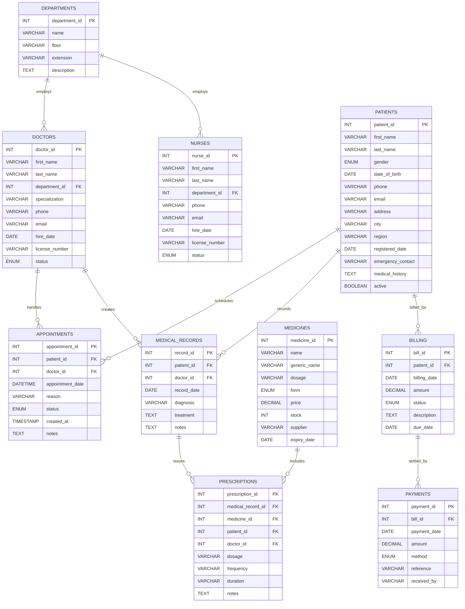

# Clinic Management System Documentation

## 1. Project Overview

**Project name:** Public Health Clinic Records Management System

**Platform:** MySQL (XAMPP)

**Purpose:**
This database supports a community health clinic by managing departments, clinical staff, patients, appointments, medical records, prescriptions, medicines, billing, and payments.

**Key goals:**
- Store patient and clinical encounter data in a normalized relational model
- Track medicines and prescriptions
- Manage billing and payment transactions
- Support reporting and clinic operations with clean referential integrity

## 2. Files in the Project

- `clinic_management_system.sql` — schema DDL for database creation
- `data/clinic_management_system_inserts.sql` — sample data insert script
- `clinic_management_system_documentation.md` — structured database documentation
- `clinic_management_system_report.md` — project report overview

## 3. Database Summary

The database contains the following tables and sample row counts:

- `departments` — 25 rows
- `doctors` — 30 rows
- `nurses` — 30 rows
- `patients` — 30 rows
- `medicines` — 30 rows
- `appointments` — 30 rows
- `medical_records` — 30 rows
- `prescriptions` — 30 rows
- `billing` — 30 rows
- `payments` — 30 rows

## 4. Entity and Table Descriptions

### departments
Stores clinic department metadata.
- `department_id` INT AUTO_INCREMENT PK
- `name` VARCHAR(100) NOT NULL UNIQUE
- `floor` VARCHAR(20) NOT NULL
- `extension` VARCHAR(10) NOT NULL
- `description` TEXT

### doctors
Stores doctor details and assignment.
- `doctor_id` INT AUTO_INCREMENT PK
- `first_name`, `last_name`
- `department_id` INT NOT NULL FK → `departments.department_id`
- `specialization` VARCHAR(100)
- `phone`, `email` (unique)
- `hire_date` DATE
- `license_number` VARCHAR(40) UNIQUE
- `status` ENUM('Active','Inactive','On Leave')

### nurses
Stores nurse details and assignment.
- `nurse_id` INT AUTO_INCREMENT PK
- `first_name`, `last_name`
- `department_id` INT NOT NULL FK → `departments.department_id`
- `phone`, `email` (unique)
- `hire_date` DATE
- `license_number` VARCHAR(40) UNIQUE
- `status` ENUM('Active','Inactive')

### patients
Stores patient personal and contact information.
- `patient_id` INT AUTO_INCREMENT PK
- `first_name`, `last_name`
- `gender` ENUM('Male','Female','Other')
- `date_of_birth` DATE
- `phone`, `email` (unique)
- `address`, `city`, `region`
- `registered_date` DATE DEFAULT CURRENT_DATE
- `emergency_contact` VARCHAR(120)
- `medical_history` TEXT
- `active` BOOLEAN DEFAULT TRUE

### medicines
Stores medication inventory.
- `medicine_id` INT AUTO_INCREMENT PK
- `name` VARCHAR(100) NOT NULL UNIQUE
- `generic_name` VARCHAR(100)
- `dosage` VARCHAR(50)
- `form` ENUM('Tablet','Capsule','Syrup','Injection','Cream','Drops')
- `price` DECIMAL(8,2)
- `stock` INT DEFAULT 0
- `supplier` VARCHAR(120)
- `expiry_date` DATE

### appointments
Tracks clinical appointments.
- `appointment_id` INT AUTO_INCREMENT PK
- `patient_id` INT NOT NULL FK → `patients.patient_id`
- `doctor_id` INT NOT NULL FK → `doctors.doctor_id`
- `appointment_date` DATETIME
- `reason` VARCHAR(255)
- `status` ENUM('Scheduled','Completed','Cancelled','No Show')
- `created_at` TIMESTAMP DEFAULT CURRENT_TIMESTAMP
- `notes` TEXT

### medical_records
Stores clinical record summaries.
- `record_id` INT AUTO_INCREMENT PK
- `patient_id` INT NOT NULL FK → `patients.patient_id`
- `doctor_id` INT NOT NULL FK → `doctors.doctor_id`
- `record_date` DATE
- `diagnosis` VARCHAR(255)
- `treatment` TEXT
- `notes` TEXT

### prescriptions
Connects medical records with prescribed medicines.
- `prescription_id` INT AUTO_INCREMENT PK
- `medical_record_id` INT NOT NULL FK → `medical_records.record_id`
- `medicine_id` INT NOT NULL FK → `medicines.medicine_id`
- `patient_id` INT NOT NULL FK → `patients.patient_id`
- `doctor_id` INT NOT NULL FK → `doctors.doctor_id`
- `dosage` VARCHAR(100)
- `frequency` VARCHAR(100)
- `duration` VARCHAR(50)
- `notes` TEXT

### billing
Records service charges for patients.
- `bill_id` INT AUTO_INCREMENT PK
- `patient_id` INT NOT NULL FK → `patients.patient_id`
- `billing_date` DATE
- `amount` DECIMAL(10,2)
- `status` ENUM('Unpaid','Paid','Partial','Cancelled')
- `description` TEXT
- `due_date` DATE

### payments
Logs payments made against bills.
- `payment_id` INT AUTO_INCREMENT PK
- `bill_id` INT NOT NULL FK → `billing.bill_id`
- `payment_date` DATE
- `amount` DECIMAL(10,2)
- `method` ENUM('Cash','Card','Mobile Money','Insurance')
- `reference` VARCHAR(100)
- `received_by` VARCHAR(100)

## 5. Relationships and Data Flow

- `departments` → `doctors` (one-to-many)
- `departments` → `nurses` (one-to-many)
- `patients` → `appointments` (one-to-many)
- `doctors` → `appointments` (one-to-many)
- `patients` → `medical_records` (one-to-many)
- `doctors` → `medical_records` (one-to-many)
- `medical_records` → `prescriptions` (one-to-many)
- `medicines` → `prescriptions` (one-to-many)
- `patients` → `billing` (one-to-many)
- `billing` → `payments` (one-to-many)

## 6. Design Decisions

- **Normalization**: Each entity is stored in its own table to prevent data redundancy.
- **Referential integrity**: Foreign keys enforce correctness between related tables.
- **Status enums**: Used to control valid states for appointments, staff, bills, and payment methods.
- **Unique constraints**: Applied to emails, license numbers, and medicine names.
- **Separate data load**: Schema and sample inserts are stored in separate files to improve maintainability.

## 7. Installation and Usage

1. Create the schema:

```sql
mysql -u root -p < clinic_management_system.sql
```

2. Load sample data:

```sql
mysql -u root -p clinic_management_system < data/clinic_management_system_inserts.sql
```

3. Verify the tables:

```sql
USE clinic_management_system;
SHOW TABLES;
SELECT COUNT(*) FROM patients;
SELECT COUNT(*) FROM appointments;
```

## 8. Example Queries

- List all patients:

```sql
SELECT * FROM patients ORDER BY last_name, first_name;
```

- Show upcoming appointments:

```sql
SELECT a.appointment_id, p.first_name, p.last_name, d.first_name, d.last_name, a.appointment_date, a.status
FROM appointments a
JOIN patients p ON a.patient_id = p.patient_id
JOIN doctors d ON a.doctor_id = d.doctor_id
WHERE a.appointment_date >= NOW()
ORDER BY a.appointment_date;
```

- View patient billing and payment status:

```sql
SELECT b.bill_id, p.first_name, p.last_name, b.amount, b.status, b.due_date, COALESCE(SUM(pay.amount), 0) AS paid_amount
FROM billing b
JOIN patients p ON b.patient_id = p.patient_id
LEFT JOIN payments pay ON pay.bill_id = b.bill_id
GROUP BY b.bill_id;
```

- Find low-stock medicines:

```sql
SELECT name, stock, supplier
FROM medicines
WHERE stock < 25
ORDER BY stock ASC;
```

## 9. Notes and Best Practices

- Keep `clinic_management_system.sql` as schema-only.
- Load sample data from `data/clinic_management_system_inserts.sql`.
- Use application-level or stored-procedure validation for complex business rules.
- Back up the database before schema changes.
- Use least privilege for MySQL users and restrict local access.

## 10. ER Diagram


